## 一键拥有自己的豆包 AI 手机，全界面操作，告别命令行，AutoGLM-GUI 桌面版使用保姆级别教程

## 效果展示

先给大家看看实际效果：
 **让 AI 帮我点一杯奶茶。**

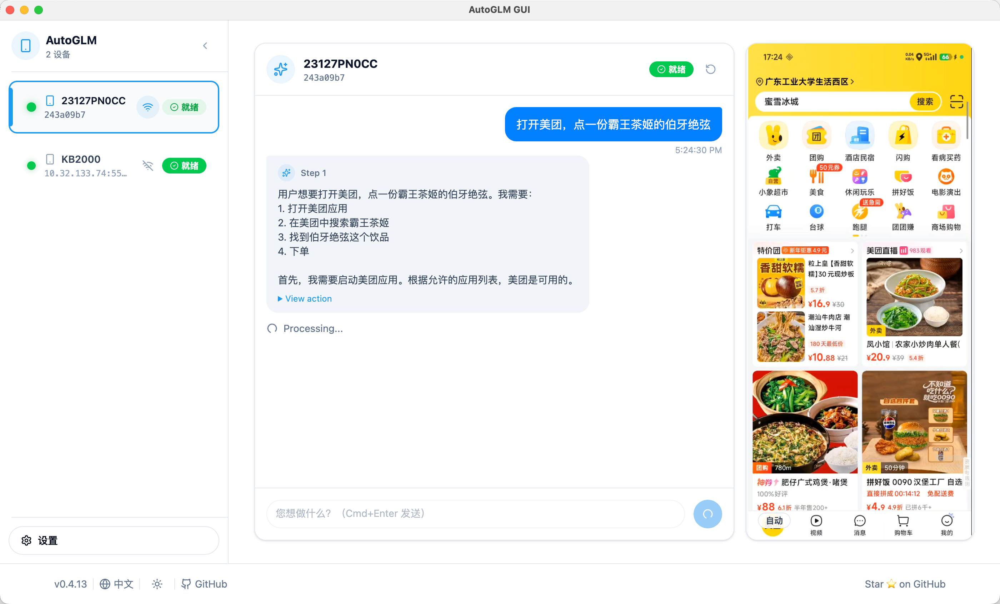

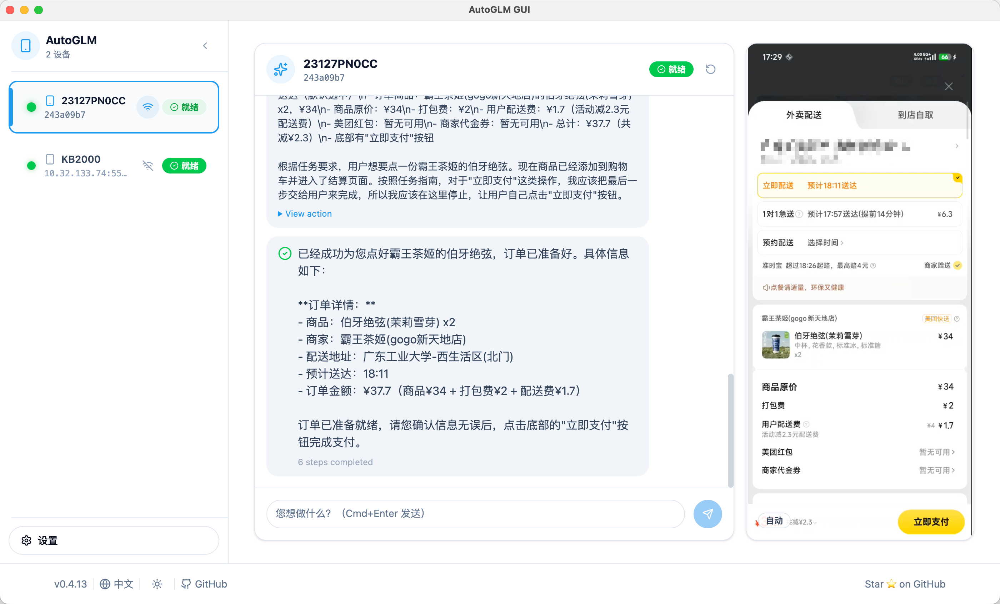

从理解自然语言 → 打开 App → 点击 → 输入 → 确认，全程由 AI 自动完成。

## AutoGLM-GUI 是什么？

https://github.com/suyiiyii/AutoGLM-GUI

Open-AutoGLM 是智谱开源的一个ai 操作智能手机的框架，但原生使用方式对普通用户并不友好，需要命令行操作，需要安装 adb等依赖。而 AutoGLM-GUI 基于 Open-AutoGLM 提供了更加友好的用户体验，支持自动安装adb keyboard 等依赖，降低了使用的门槛。

目前支持：

- 图形化界面操作
- 自动安装 ADB Keyboard 等依赖
- 多设备连接与切换
- 直接点击屏幕操控手机

## 准备

* 一部手机（Android / iOS / 鸿蒙）
* 一台电脑（Windows / macOS）
* 一根数据线（有更好，没有也可以无线调试）

## 步骤

### 1.下载 & 启动

先打开项目首页https://github.com/suyiiyii/AutoGLM-GUI，找到快速下载这里

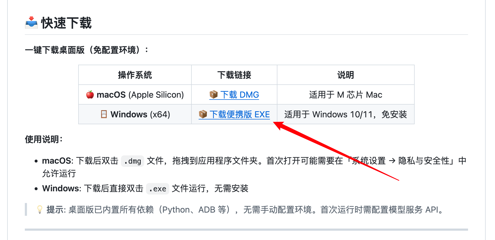

我们根据自己的系统，选择下载，以下以 windows 系统为例

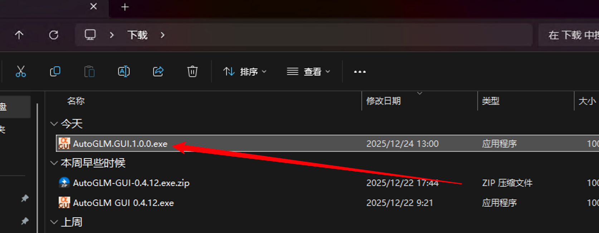

下载下来是这样子的 exe 文件，直接双击启动即可，不需要安装。根据电脑性能，可能要等一会

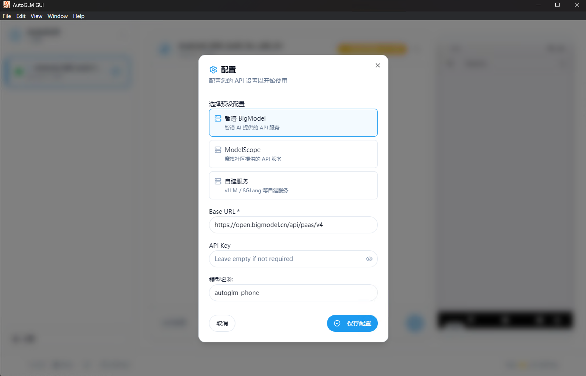

打开来第一时间，就会让我们去配置 api

### 2. 获取 apikey

简单来说，AutoGLM 分为控制端和模型端两个部分，我们在自己电脑上面运行的是控制端，这个是直接控制我们手机的。

但是大模型毕竟是大模型，几十亿上百亿的参数，我们自己电脑很难运行，所以这个时候是使用的官方托管的模型，我们直接调用智谱官方托管好的就行了

直接打开：https://bigmodel.cn/login?redirect=%2Fusercenter%2Fproj-mgmt%2Fapikeys ，这个是智谱官方的模型平台

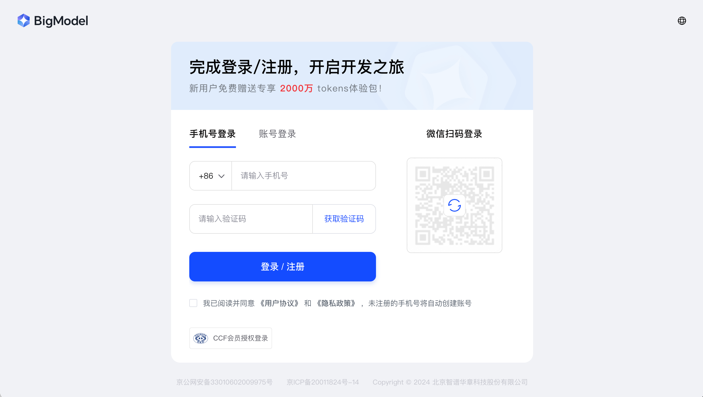

直接使用手机号登录，免费的。目前好像还是推广期，调用模型不花钱。

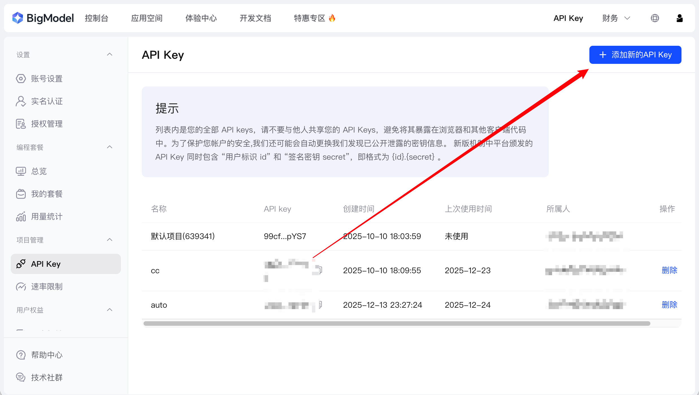

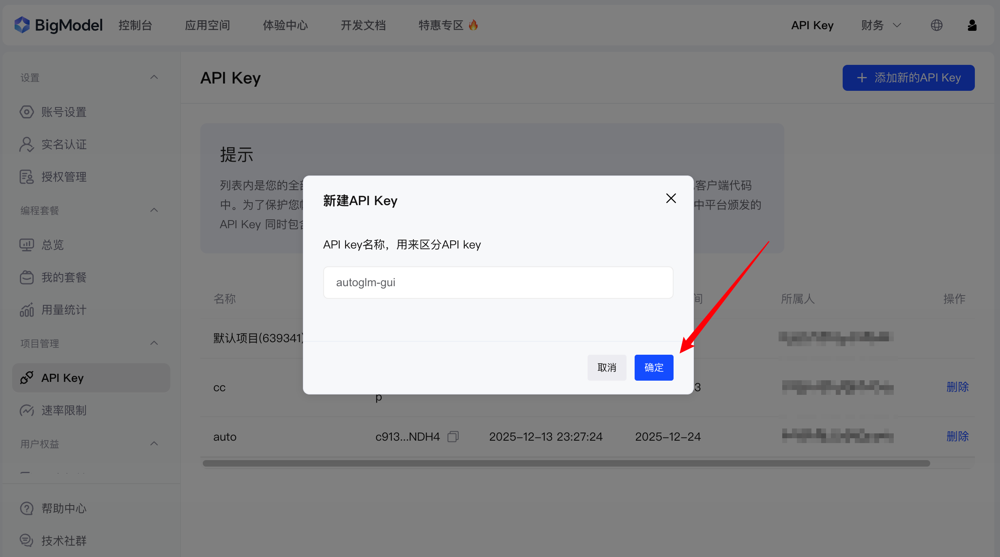

直接随便取一个名字，新建一个 key

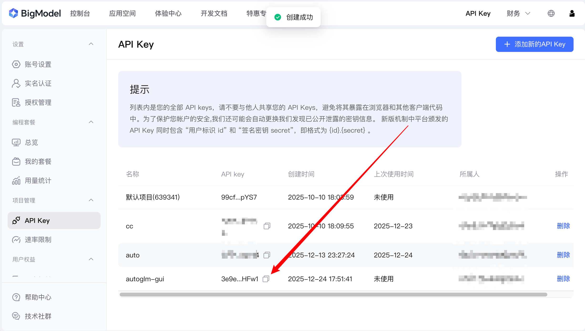

复制生成的 Key，粘贴到 AutoGLM-GUI 的配置界面中即可（URL 默认已经配置好，如果只是使用官方模型，不需要修改）

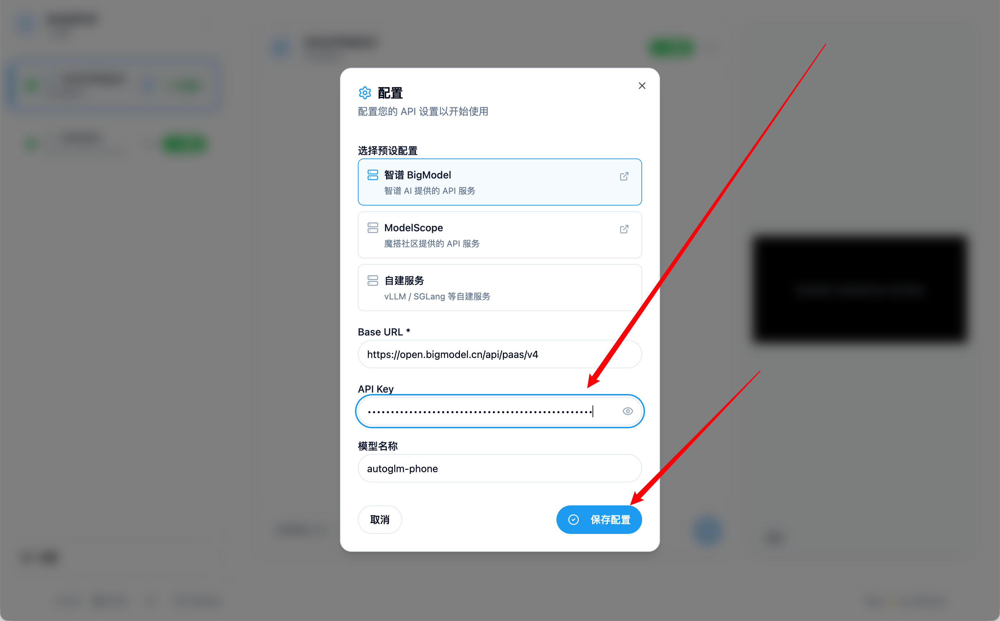

### 3. 启用ADB调试

这个相信大家都非常熟悉，但是为了教程的完整性，在这里还是简单提一下

1. **找到版本号**：进入「设置」 -> 「关于手机」 -> 找到「版本号」或「编译编号」。

2. **开启开发者模式**：连续快速点击「版本号」**7次**，直到屏幕提示“您已处于开发者模式”。

3. **进入开发者选项**：返回「设置」（或「系统设置」/「更多设置」），找到新出现的「开发者选项」。

4. **开启调试**：在开发者选项中，找到并开启「USB 调试」。

要注意的是，看看 USB 调试设置周围有没有其他安全设置，也记得同步调整一下。像小米，就有一个 USB 调试安全的配置，不开启就无法模拟点击~~（别问我是怎么知道的）~~。以及有的手机需要把连接电脑的模式调整到「文件传输」。

## 开始体验

开启 USB 调试之后，界面上面应该就直接显示出你的设备了，代表着配置完毕，可以开始体验了，可以打开计算器，让 ai 简单操作一下，如果没啥问题就代表一切就绪了。

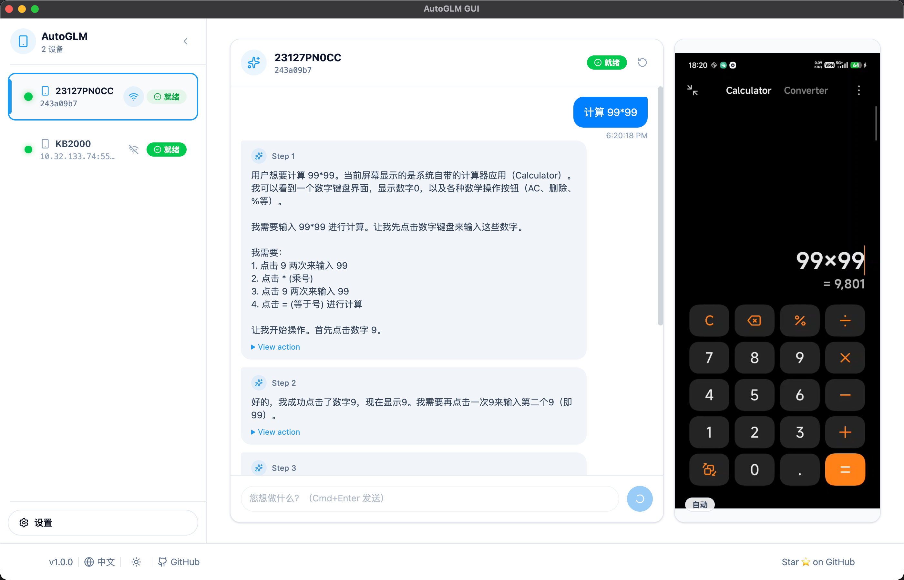

最右边的屏幕还支持直接点击操控手机，连接到多设备之后，还可以在左边侧边栏进行切换

## FAQ

#### 支持 iPhone / iOS 吗？

正在适配中，已经跑通流程，但是由于比较复杂，还在完善相关支持

#### 需要 Root 手机吗？

不需要。
 AutoGLM-GUI 使用的是 **官方 ADB 能力**，无需 Root，也不会修改系统文件

#### 设备列表是空的，看不到手机怎么办？

请按顺序检查：

1. 手机是否开启 **USB 调试**
2. 是否在手机上点了 **“允许 USB 调试”**
3. 数据线是否支持数据传输（不是纯充电线）
4. USB 连接模式是否为「文件传输」

### 最后

如果这个[项目](https://github.com/suyiiyii/AutoGLM-GUI)对你有帮助，欢迎：

- GitHub Star
- 提 Issue / PR
